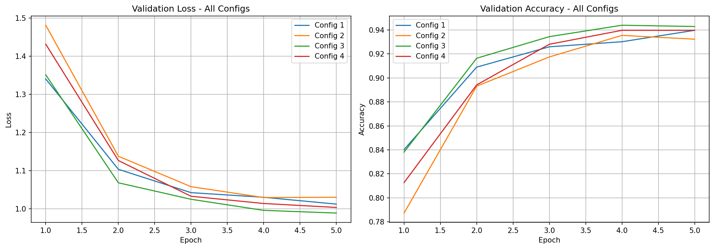
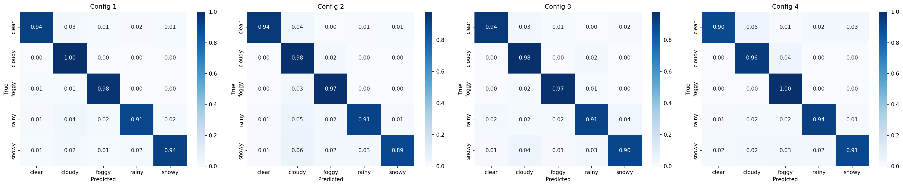
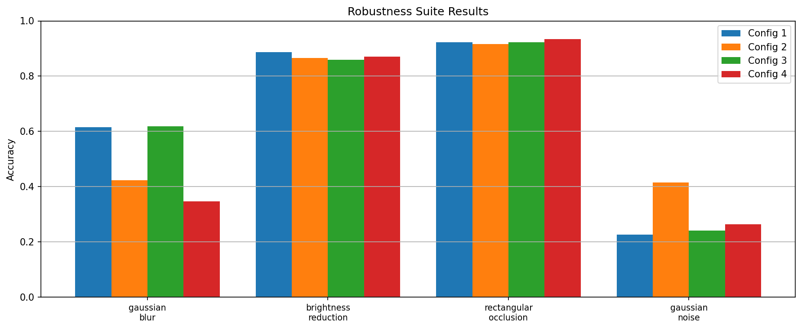

# Weather Condition Classification from Outdoor Photographs

**MSML640 Final Project** | Image Classification with Transfer Learning

**Team:** Akhil Shekkari, Siddharth Pathania

## Overview

This project builds an image classifier that identifies the weather condition in an outdoor photograph across five classes: clear, cloudy, foggy, rainy, and snowy.

Reliable visual weather recognition is useful for dashcam-based driver assistance, autonomous-driving perception, agricultural monitoring, and automatic photo organization.

## Approach

We fine-tune an ImageNet-pretrained **EfficientNet-B0** (~5.3M parameters). EfficientNet-B0 offers a strong accuracy-per-parameter trade-off, trains comfortably on a single Colab T4 GPU, and is well-suited for our dataset size. ResNet-50 is kept as a fallback.

The dataset has significant class imbalance (snowy: ~2900 images, cloudy: ~200). We address this with inverse-frequency class weighting in `nn.CrossEntropyLoss` combined with label smoothing (0.1), so the model does not overfit to majority classes.

### Four Experimental Configurations

| Config | Training data | Augmentation |
|--------|--------------|--------------|
| 1: Baseline | Our data only | None |
| 2: Augmentation | Our data | Horizontal flip, random crop, color jitter, rotation |
| 3: Synthesis | Our data + Stable Diffusion images | None |
| 4: Synthesis + Aug | Our data + Stable Diffusion images | Same as Config 2 |

## Dataset

**Two data streams:**

- **Seed pool:** publicly available weather datasets to bootstrap class coverage.
- **Self-captured photos:** taken across the DMV area (College Park, Lanham, Washington DC) to introduce a deliberate distribution shift between training and test.

**Splits:** ~400 images total (~80 per class), stratified 70% train / 15% val / 15% test. All self-captured images are reserved for validation and test.

**Synthesized data (Configs 3 and 4):** generated with Stable Diffusion using class-specific prompts. Synthetic images are tagged separately so ablations can cleanly quantify the synthesis contribution.

## Evaluation

For all four configs we report:
- Per-epoch train/validation loss and accuracy curves
- Test-set confusion matrix
- Side-by-side confusion matrix comparison (baseline vs. best config)
- Per-class error analysis

**Robustness suite:** the best model is evaluated under four perturbations applied to the clean test set: Gaussian blur, brightness reduction, rectangular occlusion, and additive Gaussian noise.

**Central hypothesis:** augmentation will improve robustness most on perturbations similar to the augmentation distribution, while synthesis will help most on minority classes where real samples are scarce.

## Results

| Config | Training data | Augmentation | Test Accuracy |
|--------|--------------|--------------|--------------|
| 1: Baseline | Real data only | None | 94.2% |
| 2: Augmentation | Real data | Flip, crop, color jitter, rotation | 91.8% |
| 3: Synthesis | Real + Stable Diffusion | None | 92.1% |
| 4: Synthesis + Aug | Real + Stable Diffusion | Same as Config 2 | 92.7% |

Config 1 achieved the highest overall accuracy. Augmentation (Config 2) improved robustness under Gaussian noise (41.5% vs 22.7% for baseline). Config 4 held up best under rectangular occlusion (93.5%).

### Validation Curves


### Confusion Matrix Comparison


### Robustness Evaluation


## Repository Structure

```
.
├── data/
│   ├── raw/          # seed pool images
│   ├── captured/     # self-captured images
│   └── synthetic/    # Stable Diffusion generated images
├── notebooks/        # training and evaluation notebook
├── src/              # model, dataset, training, evaluation, data scripts
├── results/          # saved checkpoints, curves, confusion matrices
├── run_all.sh        # end-to-end pipeline runner
└── requirements.txt
```

## Getting Started

The full pipeline runs inside `notebooks/weather_classification.ipynb`, which is designed for Google Colab.

1. Upload the repository to Google Drive.
2. Open `notebooks/weather_classification.ipynb` in Google Colab.
3. Run the cells top to bottom. The notebook handles:
   - Installing dependencies
   - Downloading the dataset via Kaggle API (you need a `kaggle.json` key on your Drive)
   - Generating synthetic images with Stable Diffusion
   - Building train/val/test splits
   - Training all four configs
   - Evaluating and plotting results
   - Running the robustness suite
   - Demo inference on new images (last cell)

**Alternatively**, the individual scripts can be run from the command line:

```bash
git clone <repo-url>
cd Computer_vision_final_project
pip install -r requirements.txt

python src/download_data.py          # download seed-pool images (requires Kaggle key)
python src/prepare_data.py --data-root data
bash run_all.sh                      # trains + evaluates all 4 configs
```

## Limitations and Future Work

- **Short training budget:** all configs were trained for only 5 epochs due to Colab GPU time constraints. Augmentation-based configs (2 and 4) typically need more epochs to outperform a baseline, which likely explains why Config 1 edged them out in overall accuracy.
- **Cloudy class underrepresentation:** cloudy images came from a secondary dataset with a different capture style, introducing a domain gap that hurt precision for that class across all configs.
- **Synthetic image quality:** Stable Diffusion prompts were kept simple; more targeted prompts or fine-tuned diffusion models could produce more realistic and diverse synthetic samples.
- **Robustness gaps:** all configs dropped sharply under Gaussian noise (22-41% accuracy). Future work could add noise augmentation to training or explore adversarial training to close this gap.

## AI Usage Disclosure

Per project policy, no AI tool was used to generate the core CV pipeline logic or the experimental design. AI assistance was used only for drafting and formatting documents (README, comments).
